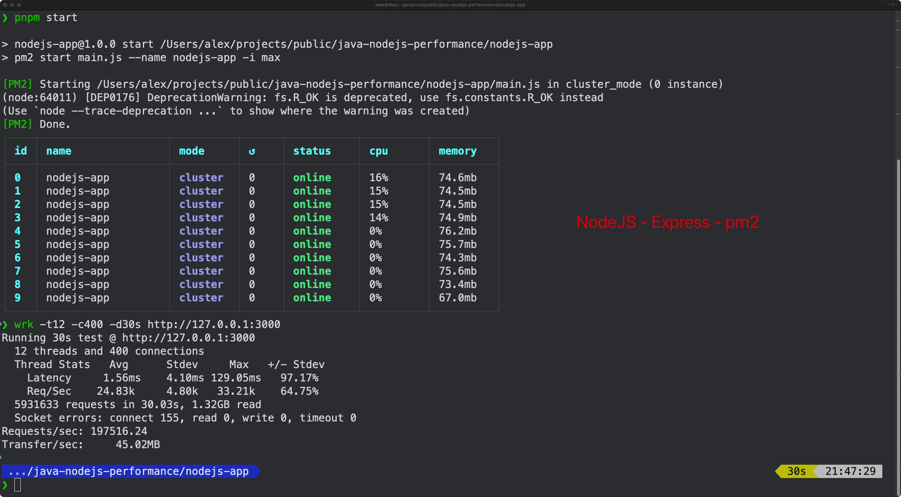
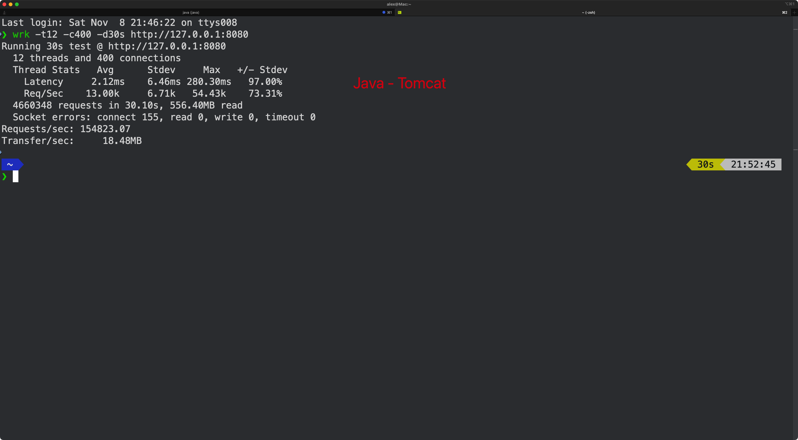

# What's the repo made for?

This repo try to compare the `I/O performance`of`nodejs-express`and`java-springboot` via [wrk](https://github.com/wg/wrk)

## nodejs-express

### How to test

- prerequisites
  - install nodejs and pm2
  - install dependencies

```bash
npm i pnpm -g
pnpm i
pnpm start
wrk wrk -t12 -c400 -d30s http://127.0.0.1:3000
```

## java-springboot

### How to test

- prerequisites
  - install java and IDEA
  - install dependencies(automatic download in IDEA)
  - run package by Maven to get jar file

```bash
java -jar target/demo-0.0.1-SNAPSHOT.jar
wrk wrk -t12 -c400 -d30s http://127.0.0.1:8080
```

# Some results





